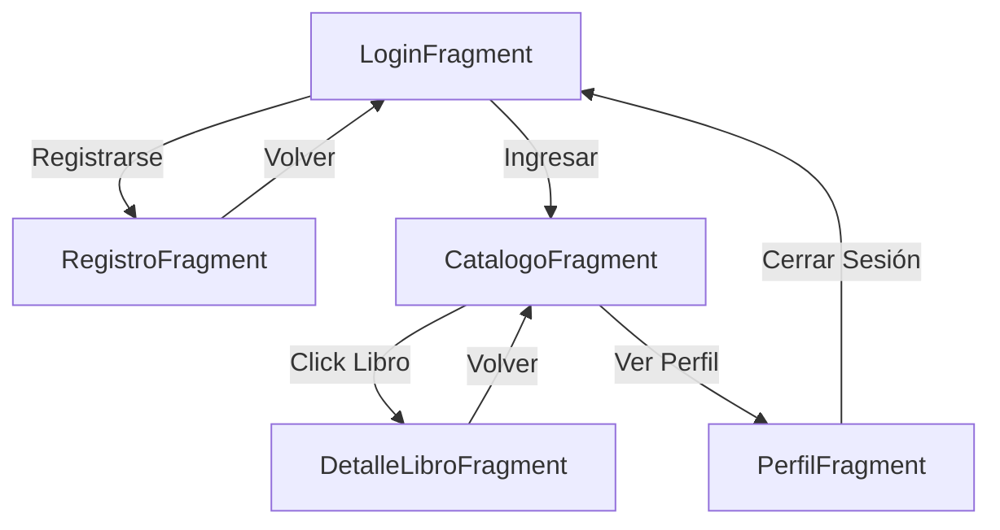

# Documentación del Diseño de la Aplicación - Proyecto Biblioteca

Este documento detalla la arquitectura de navegación, la interfaz visual y la integración con servicios externos.

## 1. Mapa de Navegación

La aplicación utiliza un componente **NavHost** centralizado en `MainActivity` para gestionar el flujo entre fragmentos.



---

## 2. Mockup de Pantallas (Descripción)

1.  **Login**: Pantalla con logo, campos de Usuario/Password, botón de ingreso y enlace a registro.
2.  **Registro**: Formulario extenso (Nombre, Cédula, Correo, etc.) con validación de datos.
3.  **Catálogo**: Lista vertical (`RecyclerView`) que muestra portadas, títulos y autores obtenidos de la API. Incluye un botón de acceso al perfil.
4.  **Detalle del Libro**: Pantalla con imagen de portada ampliada, descripción detallada del libro y metadatos (ISBN, número de páginas).
5.  **Perfil**: Ficha del usuario con sus datos personales y opción de desconexión.

---

## 3. Integración API REST (Open Library)

Se ha seleccionado la API de **Open Library** por ser abierta, gratuita y no requerir llaves de acceso (API Key).

### Endpoints Principales

*   **Listado (Búsqueda)**:
    `GET https://openlibrary.org/search.json?q=android&limit=10`
    *Uso: Carga inicial del catálogo con una temática específica.*

*   **Detalle del Libro**:
    `GET https://openlibrary.org/works/{WORK_ID}.json`
    *Uso: Obtener la descripción y datos específicos al seleccionar un libro.*

*   **Imágenes (Portadas)**:
    `https://covers.openlibrary.org/b/id/{COVER_ID}-L.jpg`

### Ejemplo de Respuesta JSON (Listado)

```json
{
  "numFound": 1,
  "docs": [
    {
      "key": "/works/OL27479W",
      "title": "Cien años de soledad",
      "author_name": ["Gabriel García Márquez"],
      "first_publish_year": 1967,
      "cover_i": 123456
    }
  ]
}
```
