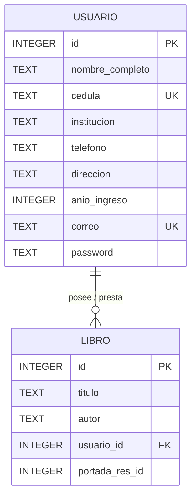

# Documentación del Diseño de Base de Datos - Proyecto Biblioteca

Este documento resume la estructura de datos implementada para el sistema de gestión de biblioteca.

## 1. Diagrama Entidad-Relación (ERD)

La relación es de **1 a N**: Un usuario puede tener muchos libros asignados (préstamos), pero un libro pertenece a un solo usuario a la vez.



---

## 2. Diccionario de Datos

### Tabla: `usuarios`
| Campo | Tipo SQLite | Restricciones | Descripción |
| :--- | :--- | :--- | :--- |
| `id` | INTEGER | PRIMARY KEY, AUTOINCREMENT | Identificador único del usuario |
| `nombre_completo` | TEXT | NOT NULL | Nombre y apellido |
| `cedula` | TEXT | UNIQUE, NOT NULL | Documento de identidad |
| `institucion` | TEXT | - | Colegio o Universidad |
| `telefono` | TEXT | - | Número de contacto |
| `direccion` | TEXT | - | Domicilio |
| `anio_ingreso` | INTEGER | - | Año lectivo de ingreso |
| `correo` | TEXT | UNIQUE, NOT NULL | Email de acceso |
| `password` | TEXT | NOT NULL | Clave de acceso |

### Tabla: `libros`
| Campo | Tipo SQLite | Restricciones | Descripción |
| :--- | :--- | :--- | :--- |
| `id` | INTEGER | PRIMARY KEY, AUTOINCREMENT | Identificador único del libro |
| `titulo` | TEXT | NOT NULL | Título de la obra |
| `autor` | TEXT | NOT NULL | Autor de la obra |
| `usuario_id` | INTEGER | FOREIGN KEY (usuarios.id) | ID del usuario que tiene el libro |
| `portada_res_id` | INTEGER | - | Referencia al recurso de imagen |

---

## 3. Scripts de Creación (SQL)

Estos comandos definen la estructura de las tablas en SQLite:

```sql
-- Crear tabla de Usuarios
CREATE TABLE IF NOT EXISTS usuarios (
    id INTEGER PRIMARY KEY AUTOINCREMENT,
    nombre_completo TEXT NOT NULL,
    cedula TEXT UNIQUE NOT NULL,
    institucion TEXT,
    telefono TEXT,
    direccion TEXT,
    anio_ingreso INTEGER,
    correo TEXT UNIQUE NOT NULL,
    password TEXT NOT NULL
);

-- Crear tabla de Libros con Clave Foránea
CREATE TABLE IF NOT EXISTS libros (
    id INTEGER PRIMARY KEY AUTOINCREMENT,
    titulo TEXT NOT NULL,
    autor TEXT NOT NULL,
    portada_res_id INTEGER,
    usuario_id INTEGER,
    FOREIGN KEY (usuario_id) REFERENCES usuarios(id) ON DELETE SET NULL
);
```

---

## 4. Consulta JOIN

Esta consulta permite obtener una lista de libros junto con el nombre del usuario que los tiene actualmente:

```sql
SELECT
    usuarios.nombre_completo AS "Estudiante",
    libros.titulo AS "Libro Prestado",
    libros.autor AS "Autor"
FROM usuarios
INNER JOIN libros ON usuarios.id = libros.usuario_id;
```
