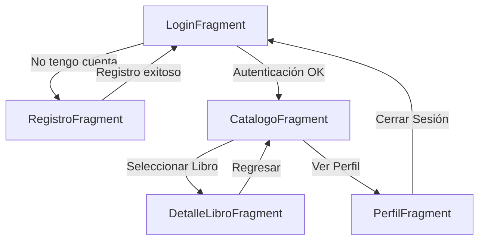

# Informe Técnico: Diseño de la Aplicación - Proyecto Biblioteca

Este documento detalla el diseño funcional, visual y la integración de servicios de la aplicación "Biblioteca".

---

## 1. Mapa de Navegación (Arquitectura)

La aplicación utiliza un componente **NavHost** centralizado con una arquitectura de navegación lineal y jerárquica, permitiendo un flujo fluido entre el acceso, la consulta de datos y la gestión del perfil.

### Diagrama de Flujo


**Descripción de Rutas:**
*   **Acceso**: El usuario inicia en el Login. Si no está registrado, pasa al formulario de Registro.
*   **Principal**: Tras el login, se accede al Catálogo (Pantalla Principal).
*   **Consulta**: Desde el catálogo se puede profundizar en los detalles de un libro específico.
*   **Gestión**: El usuario puede consultar y gestionar su información personal en el Perfil.

---

## 2. Mockup y Funcionalidad de Pantallas

### A. Login (Inicio de Sesión)
*   **Componentes**: Logo de la biblioteca, campos de texto para correo/usuario y contraseña (con opción de ocultar/ver), botón de "Ingresar".
*   **Funcionalidad**: Valida las credenciales contra la base de datos local (Room) y guarda la sesión activa.

### B. Registro de Usuario
*   **Componentes**: Formulario extendido con 8 campos (Nombre, Cédula, Institución, Celular, Dirección, Año de ingreso, Correo y Contraseña).
*   **Funcionalidad**: Valida que el correo o cédula no existan previamente y crea el nuevo perfil en la base de datos.

### C. Catálogo (Exploración)
*   **Componentes**: Barra de búsqueda (`SearchView`), lista dinámica (`RecyclerView`) con portadas de libros, títulos y autores.
*   **Funcionalidad**: Carga libros en tiempo real desde la API de Open Library. Permite filtrar resultados mediante palabras clave.

### D. Detalle del Libro
*   **Componentes**: Portada ampliada, título en negrita, autor, y un bloque de descripción extensa.
*   **Funcionalidad**: Realiza una segunda petición a la API para obtener la descripción específica del libro seleccionado.

### E. Perfil de Usuario
*   **Componentes**: Ficha técnica con los datos del usuario logueado y botón de "Cerrar Sesión".
*   **Funcionalidad**: Recupera los datos de la sesión activa y permite desconectarse de la aplicación.

---

## 3. Integración API REST: Open Library

Se ha integrado el servicio **Open Library API**, una base de datos global de libros que no requiere llaves de acceso, ideal para proyectos educativos y de consulta rápida.

### Endpoints Utilizados

1.  **Listado y Búsqueda**:
    *   **URL**: `GET https://openlibrary.org/search.json?q={query}&limit=10`
    *   **Propósito**: Obtener una lista de libros que coincidan con el texto ingresado en la barra de búsqueda.

2.  **Detalle del Obra**:
    *   **URL**: `GET https://openlibrary.org/works/{work_id}.json`
    *   **Propósito**: Recuperar la sinopsis o descripción completa de un libro.

3.  **Servicio de Imágenes (Covers)**:
    *   **URL**: `https://covers.openlibrary.org/b/id/{cover_id}-L.jpg`
    *   **Propósito**: Cargar la imagen de portada mediante la librería Coil.

### Ejemplo de Respuesta JSON (Modelo Simplificado)
```json
{
  "docs": [
    {
      "key": "/works/OL27479W",
      "title": "Cien años de soledad",
      "author_name": ["Gabriel García Márquez"],
      "cover_i": 123456,
      "first_publish_year": 1967
    }
  ]
}
```
